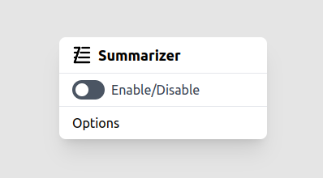
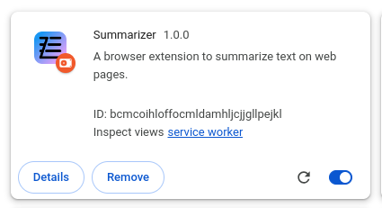

# Run

## Dev

Development mode allows to preview following UIs:
- Summarizer
- Summarizer Modal
- Browser Extension Options 
- Browser Extension Popup

```bash
npm run dev
```

The localhost server will list all files, including the interfaces inside `preview` directory:


Then choose which interface you want to check (e.g. Popup):



## Prod

Production mode is the unpacked browser extension itself.
```bash
npm run build
```

A new directory named `dist` will be generated as output. That should contain all needed files, already structured, for the Chrome browser to load it.


Then you just have to go to the [Chrome extensions](chrome://extensions/) page and click on "Load unpacked". Target and select the `dist` directory.


